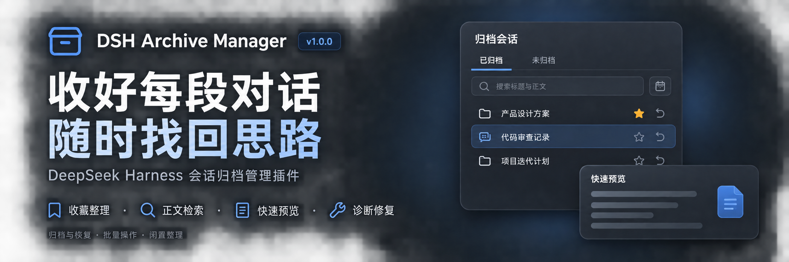
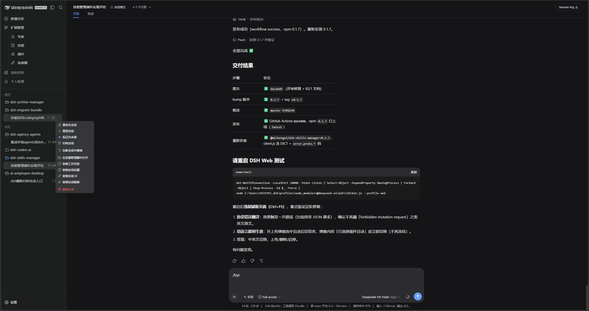

<p align="center">
  
</p>

<div align="center">

  # DSH Archive Manager

  **Safely manage archived sessions in DeepSeek Harness**

  [简体中文](README.zh-CN.md) · [Changelog](CHANGELOG.md) · [Apache-2.0](LICENSE)

  [](LICENSE)
  [](https://www.npmjs.com/package/@michengai/dsh-archive-manager)
  [](https://www.npmjs.com/package/@michengai/dsh-archive-manager)
  [](https://github.com/MichengAI/dsh-archive-manager)
</div>

> DSH Archive Manager is a community-maintained DeepSeek Harness (DSH) plugin, not an official DeepSeek AI product.

## What you can do

Put inactive conversations away and find them again when needed, keeping everyday task lists tidy.

- **Archive conversations**: put away one chat or all unarchived chats in a workspace.
- **Find past work**: search titles, filter by project, and sort by time or title.
- **Restore tasks**: restore one chat, selected chats, a project group, or all archives.
- **Clean up records**: permanently delete unwanted archived conversations after confirmation.

## Screenshots

Archive a chat from the sidebar session menu:



Find, restore, and clean up chats in **Settings → Archived sessions**:


## Prerequisites

- A working [DeepSeek Harness](https://github.com/deepseek-ai/deepseek-harness) Web installation with `dsh` available in your terminal.
- Supported DSH versions: `0.1.0-rc.8`, `0.1.1-rc.2`, `0.1.2-rc.1`, `0.1.5-rc.1`, `0.1.5-rc.2`, and `0.1.6-alpha.1`. Other versions are not currently supported.
- Node.js matching `^22.19.0 || >=24.0.0`. Source installation also requires pnpm.

## Installation

Examples use the `web` profile. Replace it with the profile you actually use.

### Ask an agent to install it

Send this prompt to an agent that can run terminal commands on your computer:

```text
Install the latest @michengai/dsh-archive-manager into my local DSH web profile using the official npm registry. Check the plugin configuration afterward, then explain how to reload DSH and open archived session management.
```

### Install manually

Run in PowerShell:

```powershell
[Console]::OutputEncoding = [System.Text.Encoding]::UTF8
$OutputEncoding = [System.Text.Encoding]::UTF8

dsh plugin --profile web add @michengai/dsh-archive-manager@latest --registry=https://registry.npmjs.org/
```

Restart DSH Web, then hard-refresh your browser with `Ctrl+Shift+R`. Open **Settings → Archived sessions** to get started.

## Usage

| Goal | Action |
| --- | --- |
| Archive one chat | Open its sidebar menu and choose **Archive session** |
| Archive a workspace | Open the workspace menu and choose the option to archive its chats |
| Find an archive | Open **Settings → Archived sessions**, then search titles or filter by project |
| Change the order | Sort by update time, creation time, or title |
| Restore one chat | Click **Restore** beside the session |
| Archive a project or ungrouped chats | On **Unarchived**, open the group’s **…** menu and confirm archiving all chats in that group, regardless of search filters |
| Archive across projects | Switch to **Unarchived**, select sessions across projects, then click **Archive** and confirm |
| Restore or delete in bulk | Select chats and use the bulk actions, or use the project menu or page-wide actions |

The page opens on **Archived**, with **Unarchived** on the right. Switching tabs clears selections; changing search or project filters preserves them. Check the hidden selection count before applying bulk actions, or clear your selection first.

**Restore all / Delete all** remain on the Archived tab and apply to archived sessions across all projects, regardless of filters. Unarchived excludes subagents and blank placeholders and supports sorting by update time or title.

Settings and sidebar batch archive/restore call official `ctx.workspaces.archiveSession` / `unarchiveSession` serially, using the same client projection as single-session sidebar actions.

### View and continue archived conversations

Available starting with `0.1.40`:

- **Open session**: open the native DSH session to view messages, attachments, and tool details. Continue chatting while keeping the session archived.
- **Restore and open**: unarchive the session and open it to resume work.

## Updates

Click **Check for updates** in the archive management page header. DSH CLI or Desktop environments with automatic update support can update directly; other environments provide a manual command for the current profile. You can also rerun the installation command above.

## FAQ

### Why is the entry missing after installation?

Restart DSH Web and hard-refresh your browser. Make sure you installed into the profile you are using. If the entry is still missing, run:

```powershell
[Console]::OutputEncoding = [System.Text.Encoding]::UTF8
$OutputEncoding = [System.Text.Encoding]::UTF8

dsh --profile web --dump-config
```

The configuration should include `workspace-archive-manager` and `ui-workspace-archive-manager`. On DSH 0.1.6+, official `ui-settings-unarchive-sessions` should be `disabled: true` so Settings keeps only this plugin's Archived sessions page. If you previously set the official `ui-workspace` to `disabled: true` in your profile's `cordis.patch.yml`, remove that disabling override and restart.

### How is archiving different from deletion?

Archiving puts a conversation away so you can restore it later. **Permanent deletion cannot be undone** and may also remove that session's attachments. It does not delete your project working directory. Deletion requires confirmation.

### Can I use it with Codex UI?

Yes. [Codex UI](https://github.com/MichengAI/dsh-codex-ui) keeps its sidebar appearance and interactions. Archive management remains available in **Settings → Archived sessions**.

For other problems, open an [issue](https://github.com/MichengAI/dsh-archive-manager/issues) with your DSH and plugin versions, reproduction steps, and error details.

## Install from source

<details>
<summary>Expand for development or testing unreleased changes</summary>

Run these commands in a directory of your choice. For local changes that have not been pushed, use the existing working copy.

```powershell
[Console]::OutputEncoding = [System.Text.Encoding]::UTF8
$OutputEncoding = [System.Text.Encoding]::UTF8

git clone https://github.com/MichengAI/dsh-archive-manager.git
Set-Location .\dsh-archive-manager
pnpm install --frozen-lockfile
pnpm build
dsh plugin --profile web add .
```

Restart DSH Web and hard-refresh your browser afterward. Edit [src](src), not the generated `lib` directory. Run `pnpm test` to validate changes or `pnpm verify` for the full checks.

</details>

## DSH product ecosystem

For a desktop workbench, download [DSH Codex Desktop](https://github.com/MichengAI/dsh-codex-desktop/releases). Existing [DeepSeek Harness](https://github.com/deepseek-ai/deepseek-harness) installations can add plugins as needed by following each project's README. Below are 11 first-party plugins; consult the corresponding desktop release notes and bundled catalog for what that version includes.

| Plugin | What you can do |
| --- | --- |
| [Codex UI](https://github.com/MichengAI/dsh-codex-ui) | Organize projects and conversations, search tasks, and navigate chat turns |
| [Agency Agents](https://github.com/MichengAI/dsh-agency-agents) | Choose and summon specialists for your task |
| [Skills Manager](https://github.com/MichengAI/dsh-skills-manager) | Find, enable, create, and import local skills |
| [Archive Manager](https://github.com/MichengAI/dsh-archive-manager) | Search, restore, or clean up archived conversations |
| [IM Connect](https://github.com/MichengAI/dsh-im-connect) | Send tasks and receive replies through messaging platforms |
| [Automation](https://github.com/MichengAI/dsh-automation) | Schedule tasks and review each run |
| [BTW](https://github.com/MichengAI/dsh-btw) | Ask side questions without interrupting the main task |
| [Simplify](https://github.com/MichengAI/dsh-simplify) | Use `/simplify` to improve code within your Git changes |
| [PUA](https://github.com/MichengAI/dsh-pua) | Guide the Agent to try new approaches after failures, investigate causes, and verify results before completion |
| [Code Review](https://github.com/MichengAI/dsh-code-review) | Use `/review` to request an independent Agent code review and receive the report in the current conversation |
| [Codex Pet](https://github.com/MichengAI/dsh-codex-pet) | View conversation notifications and respond to tool approvals and questions through a desktop pet |


## License

Licensed under [Apache License 2.0](LICENSE).
