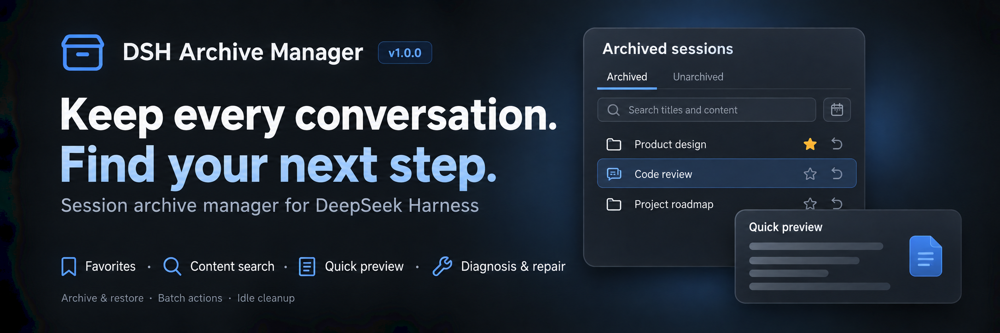
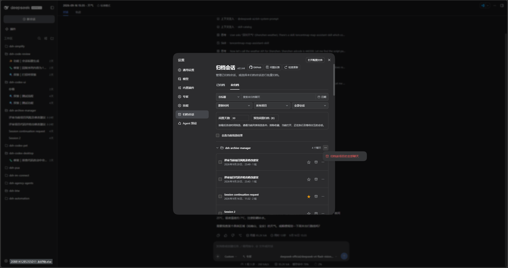

<p align="center">
  
</p>

<div align="center">

  # DSH Archive Manager

  **Safely manage archived sessions in DeepSeek Harness**

  [简体中文](README.zh-CN.md) · [Changelog](CHANGELOG.md) · [1.0.0 release notes](RELEASE_NOTES.md) · [Apache-2.0](LICENSE)

  [](LICENSE)
  [](https://www.npmjs.com/package/@michengai/dsh-archive-manager)
  [](https://www.npmjs.com/package/@michengai/dsh-archive-manager)
  [](https://github.com/MichengAI/dsh-archive-manager)
</div>

> DSH Archive Manager is a community-maintained DeepSeek Harness (DSH) plugin, not an official DeepSeek AI product.

## What you can do

Put inactive conversations away and find them again when needed, keeping everyday task lists tidy.

- **Archive conversations**: put away one chat or all unarchived chats in a workspace.
- **Find past work**: search titles and content, combine project/favorites/date filters, and sort by time, title, or turns.
- **Restore tasks**: restore one chat, selected chats, or a project group; select all filtered results for bulk actions.
- **Clean up records**: permanently delete unwanted archives after confirmation, track batch progress, and retry remaining items.
- **Organize important chats**: save favorites and preview idle cleanup while protecting favorites and active work.
- **Inspect and troubleshoot**: preview without restoring, copy IDs/paths, diagnose errors, and repair supported legacy logs.

> This README describes 1.0.0. See the release notes for the complete feature list and upgrade boundaries.

## Session diagnosis and repair

The archive page collects read failures, including archived IDs with missing summaries. Expand **Diagnosis and repair**, choose **Diagnose session**, then **Confirm repair** only when eligible. Repair converts supported legacy automation message sources while retaining the original log, conversation text, and automation attribution. Sessions must be archived and closed in every DSH process. Missing files, permission failures, and unsupported corruption are reported; messages are never truncated or deleted to force recovery. Eligibility is verified from artifacts and the host format, not solely from error wording.

## Search and preview

- Archived and Unarchived share title/content search, project, favorites, updated-date filters, and creation-time sorting. Star or unstar conversations on either tab.
- Choose **Titles and content** to search user and assistant text; the default remains titles only. Date filters include the entire local end date and combine with project and favorites.
- Matches show snippets and highlights. On Archived, click a snippet or **More → Quick preview** to inspect context without restoring. On Unarchived, a snippet opens the full conversation.
- Preview renders Markdown tables, quotes, and code blocks with role labels; switch to source text for highlights. It shows up to eight recent messages, or context around the first match. Each message is limited to 2,000 UTF-16 code units without splitting Unicode characters.
- Search accepts up to 200 query characters and reads batches of at most 20 sessions, sequentially within each batch. Tools, attachments, reasoning, system messages, and plugin injections are excluded. Read failures remain visible and can be retried. Stored text is not the model's current context.
- There is no persistent full-text index. Large or long conversations can be slow; narrow project, dates, or favorites first. No session-count or latency guarantee has been established. Changing filters prevents later batches and stale results, but cannot interrupt the batch already reading.

## Turn counts and location

- Both tabs show user submission counts, including image submissions; assistant replies, tool calls, and injected messages do not count as turns.
- Sort by most or fewest turns; unknown counts remain last. Failed details can be retried.
- **More** provides separate ID/path copying. Official JSONL storage returns the session directory; other backends use a valid host-provided path. Clipboard operations require browser permission and HTTPS or localhost; failures are reported.
- Details are read in batches of up to 20 without activating or restoring sessions. Counts include inherited user messages, have no persistent index, and may take time for long logs.

## Screenshots

Search, favorite, preview, restore, and clean up in **Settings → Archived sessions → Archived**:


Switch to **Unarchived** for the same filters, idle cleanup previews, and project-wide archiving:



> Screenshots show the pre-release development build labeled 0.1.44; this release is 1.0.0. The sidebar belongs to the installed UI plugin and does not represent new sidebar features in this release.

## Prerequisites

- A working [DeepSeek Harness](https://github.com/deepseek-ai/deepseek-harness) Web installation with `dsh` available in your terminal.
- Supported DSH versions: `0.1.0-rc.8`, `0.1.1-rc.2`, `0.1.2-rc.1`, `0.1.5-rc.1`, `0.1.5-rc.2`, `0.1.6-alpha.1`, and `0.1.6-alpha.2`. Other versions are not currently supported.
- Node.js matching `^22.19.0 || >=24.0.0`. Source installation also requires pnpm.

## Installation

Examples use the `web` profile. Replace it with the profile you actually use.

### Ask an agent to install it

Send this prompt to an agent that can run terminal commands on your computer:

```text
Install the latest @michengai/dsh-archive-manager into my local DSH web profile using the official npm registry. Check the plugin configuration afterward, then explain how to reload DSH and open archived session management.
```

### Install manually

Run in PowerShell:

```powershell
[Console]::OutputEncoding = [System.Text.Encoding]::UTF8
$OutputEncoding = [System.Text.Encoding]::UTF8

dsh plugin --profile web add @michengai/dsh-archive-manager@latest --registry=https://registry.npmjs.org/
```

Restart DSH Web, then hard-refresh your browser with `Ctrl+Shift+R`. Open **Settings → Archived sessions** to get started.

## Usage

| Goal | Action |
| --- | --- |
| Archive one chat | Open its sidebar menu and choose **Archive session** |
| Archive a workspace | Open the workspace menu and choose the option to archive its chats |
| Find an archive | Open **Settings → Archived sessions**, then choose title/content search or filter by project, favorites, and dates |
| Change the order | Sort by update time, creation time, title, or most/fewest turns |
| Restore one chat | Click the restore icon, or choose **More → Restore and open** |
| Archive a project or ungrouped chats | On **Unarchived**, open the group’s **…** menu and confirm archiving all chats in that group, regardless of search filters |
| Favorite a chat | Click its right-side star; use the favorites dropdown to filter |
| Preview archived content | Click a match snippet or **More → Quick preview** |
| Clean up idle chats | On Unarchived, set idle days, preview candidates, and confirm |
| Locate a session | Copy its ID or path from More |
| Handle read errors | Expand diagnosis, diagnose first, and confirm repair when eligible |
| Archive across projects | Switch to **Unarchived**, select sessions across projects, then click **Archive** and confirm |
| Restore or delete in bulk | Select chats and use the bulk actions, or use the project menu; there are no separate Restore all / Delete all buttons |

The page opens on **Archived**, with **Unarchived** on the right. Switching tabs clears selections; changing search or project filters preserves them. Check the hidden selection count before applying bulk actions, or clear your selection first.

**Select all filtered results** selects matching sessions, including collapsed groups. Project-wide actions still apply to the whole project regardless of search filters. Unarchived excludes subagents and blank placeholders.

Settings and sidebar batch archive/restore call the single-session APIs serially: official `ctx.workspaces.archiveSession` on every supported host, official `ctx.workspaces.unarchiveSession` on DSH 0.1.6+, and this plugin's `workspaceRegistry.unarchiveSession` on older hosts.

### Favorites and idle cleanup

Compact project groups can be collapsed. Stars and restore/archive icons appear on the right; archived session menus include restore-and-open and deletion.

- Use the star on either tab and the **Favorites only** dropdown to find important chats. Favorites persist on the host across archive, restore, and browser changes. Reopen management to see changes made in other pages. Unknown or unreadable sessions retain their stored favorite IDs; cleanup requires confirmed artifact absence.
- On Unarchived, enter 1–36,500 whole idle days and preview candidates under the current filters. Deselect individual candidates before confirmation. Favorites, the current chat, running sessions (including subagents), and pending interactions are protected; sessions without a valid activity time are excluded.
- Archive rechecks favorites and activity. Batch archive, restore, and delete report successful, skipped, failed, and remaining items; the first failure stops the batch. Retry only the remainder. Delete retries still require confirmation.
- **Undo this archive** restores sessions archived by the current batch, including successful retries. It is available only while the current management page remains open; refreshing or closing clears it. Permanent deletion cannot be undone.
- Favorites can still be archived manually. Protection applies to idle cleanup only. There is no scheduled or automatic background cleanup.

### View and continue archived conversations

Native conversation navigation has been available since `0.1.40`; 1.0.0 uses these entry points:

- **Click the session title**: open the native DSH session to view messages, attachments, and tool details. Continue chatting while keeping the session archived.
- **More → Restore and open**: unarchive the session and open it to resume work.

## Search API compatibility (integrators)

The canonical API is `workspaceRegistry.searchSessionContent({ sessionIds, query })`, covering archived and unarchived sessions. Supply 1–20 session IDs and a nonempty query of 1–200 characters; IDs are deduplicated. Results have the shape `{ items: [{ sessionId, seq, snippet }], failures: [{ sessionId, message }] }`. Individual read failures appear in `failures`; invalid input rejects the call.

`searchArchivedContent` remains the legacy, archived-only entry point. Both use the existing host Typert connection and authorization boundary; no HTTP endpoint or authentication setting is added. Keep the legacy descriptor throughout the currently supported host range, including patch releases. Removal requires an explicit compatibility-range change, client migration, and deprecation notice. New clients prefer the canonical API and use the old one only as a version fallback, never dispatching the same search to both.

## Updates

Click **Check for updates** in the archive management page header. DSH CLI or Desktop environments with automatic update support can update directly; other environments provide a manual command for the current profile. You can also rerun the installation command above.

## FAQ

### Why is the entry missing after installation?

Restart DSH Web and hard-refresh your browser. Make sure you installed into the profile you are using. If the entry is still missing, run:

```powershell
[Console]::OutputEncoding = [System.Text.Encoding]::UTF8
$OutputEncoding = [System.Text.Encoding]::UTF8

dsh --profile web --dump-config
```

The configuration should include `workspace-archive-manager` and `ui-workspace-archive-manager`. On DSH 0.1.6+, official `ui-settings-unarchive-sessions` should be `disabled: true` so Settings keeps only this plugin's Archived sessions page. If you previously set the official `ui-workspace` to `disabled: true` in your profile's `cordis.patch.yml`, remove that disabling override and restart.

### How is archiving different from deletion?

Archiving puts a conversation away so you can restore it later. **Permanent deletion cannot be undone** and may also remove that session's attachments. It does not delete your project working directory. Deletion requires confirmation.

### Can I use it with Codex UI?

Yes. [Codex UI](https://github.com/MichengAI/dsh-codex-ui) keeps its sidebar appearance and interactions. Archive management remains available in **Settings → Archived sessions**.

For other problems, open an [issue](https://github.com/MichengAI/dsh-archive-manager/issues) with your DSH and plugin versions, reproduction steps, and error details.

## Install from source

<details>
<summary>Expand for development or testing unreleased changes</summary>

Run these commands in a directory of your choice. For local changes that have not been pushed, use the existing working copy.

```powershell
[Console]::OutputEncoding = [System.Text.Encoding]::UTF8
$OutputEncoding = [System.Text.Encoding]::UTF8

git clone https://github.com/MichengAI/dsh-archive-manager.git
Set-Location .\dsh-archive-manager
pnpm install --frozen-lockfile
pnpm build
dsh plugin --profile web add .
```

Restart DSH Web and hard-refresh your browser afterward. Edit [src](src), not the generated `lib` directory. Run `pnpm test` to validate changes or `pnpm verify` for the full checks.

</details>

## DSH product ecosystem

For a desktop workbench, download [DSH Codex Desktop](https://github.com/MichengAI/dsh-codex-desktop/releases). Existing [DeepSeek Harness](https://github.com/deepseek-ai/deepseek-harness) installations can add plugins as needed by following each project's README. Below are 11 first-party plugins; consult the corresponding desktop release notes and bundled catalog for what that version includes.

| Plugin | What you can do |
| --- | --- |
| [Codex UI](https://github.com/MichengAI/dsh-codex-ui) | Organize projects and conversations, search tasks, and navigate chat turns |
| [Agency Agents](https://github.com/MichengAI/dsh-agency-agents) | Choose and summon specialists for your task |
| [Skills Manager](https://github.com/MichengAI/dsh-skills-manager) | Find, enable, create, and import local skills |
| [Archive Manager](https://github.com/MichengAI/dsh-archive-manager) | Search, restore, or clean up archived conversations |
| [IM Connect](https://github.com/MichengAI/dsh-im-connect) | Send tasks and receive replies through messaging platforms |
| [Automation](https://github.com/MichengAI/dsh-automation) | Schedule tasks and review each run |
| [BTW](https://github.com/MichengAI/dsh-btw) | Ask side questions without interrupting the main task |
| [Simplify](https://github.com/MichengAI/dsh-simplify) | Use `/simplify` to improve code within your Git changes |
| [PUA](https://github.com/MichengAI/dsh-pua) | Guide the Agent to try new approaches after failures, investigate causes, and verify results before completion |
| [Code Review](https://github.com/MichengAI/dsh-code-review) | Use `/review` to request an independent Agent code review and receive the report in the current conversation |
| [Codex Pet](https://github.com/MichengAI/dsh-codex-pet) | View conversation notifications and respond to tool approvals and questions through a desktop pet |


## License

Licensed under [Apache License 2.0](LICENSE).
