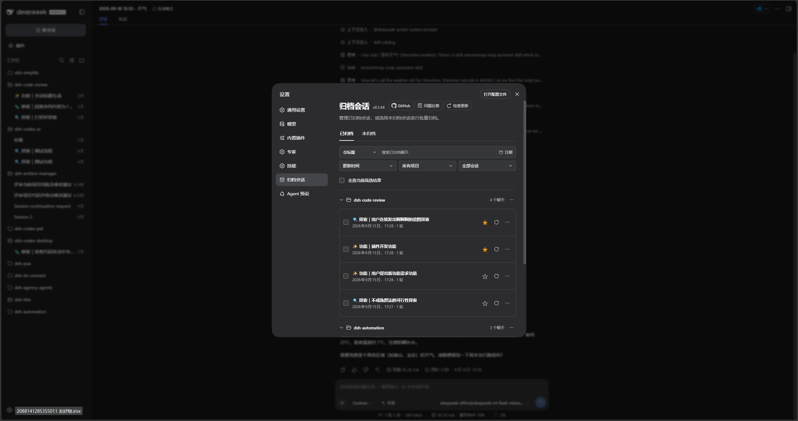

<p align="center">
  
</p>

<h1 align="center">DSH Archive Manager</h1>

<p align="center">
  <strong>A DeepSeek Harness Web plugin for safely managing archived sessions.</strong>
</p>

<p align="center">
  <a href="https://github.com/MichengAI/dsh-archive-manager/issues">Report an issue</a>
  · <a href="https://www.npmjs.com/package/@michengai/dsh-archive-manager">View on npm</a>
  · <a href="README.zh-CN.md">简体中文</a>
</p>

<p align="center">
  <a href="LICENSE"></a>
  <a href="https://www.npmjs.com/package/@michengai/dsh-archive-manager"></a>
  
  
</p>

> DSH Archive Manager is a community-maintained plugin, not an official DeepSeek AI product.

## Features

- Lists archived sessions by workspace in **Settings → Archived Sessions**.
- Safely restores a session to its original workspace position.
- Permanently deletes a confirmed session, its workspace association, archive marker, and projection cache.
- Removes unloaded deleted sessions from connected sidebars immediately.



## Prerequisites

- A working DeepSeek Harness Web installation with `dsh` available in PowerShell.
- Examples use the `web` profile; replace it with the target profile.
- Source installation and development require Node.js 22+ and pnpm. npm installation does not require running `npm install` in an arbitrary directory.

## Installation

### Install from npm

Run this from any PowerShell directory. Install into the DSH profile through `dsh plugin`, not as a dependency of an unrelated project:

```powershell
[Console]::OutputEncoding = [System.Text.Encoding]::UTF8
$OutputEncoding = [System.Text.Encoding]::UTF8
dsh plugin --profile web add @michengai/dsh-archive-manager
dsh --profile web --dump-config
```

Restart DSH Web and hard-refresh the browser after installation or upgrade. If a package mirror is behind, append `--registry=https://registry.npmjs.org/`.

### Install from source

Use this for debugging or unpublished changes. The cloned directory becomes the plugin source path:

```powershell
[Console]::OutputEncoding = [System.Text.Encoding]::UTF8
$OutputEncoding = [System.Text.Encoding]::UTF8
Set-Location D:\Repository\deepseek-harness-plugin
git clone https://github.com/MichengAI/dsh-archive-manager.git
Set-Location .\dsh-archive-manager
pnpm install --frozen-lockfile
pnpm build
dsh plugin --profile web add .
dsh --profile web --dump-config
```

Restart DSH Web and hard-refresh the browser. Local installation applies `cordis.patch.yml`; do not copy `lib` or client files manually.

## Usage

1. Open **Settings → Archived Sessions**.
2. Expand a workspace group to inspect its archived sessions.
3. Select **Unarchive** to restore a session, or **Delete** to remove it permanently.
4. Confirm deletion. **It cannot be undone.**

If the entry is missing after installation or upgrade, restart DSH Web and hard-refresh the browser. It is located directly after **Connectors** in Settings.

## Data handling limits

- Deletion always requires confirmation.
- It removes the session directory, workspace records, archive set, and projection cache.
- A live session finishes writing before cleanup to prevent data truncation.
- The plugin replaces DSH’s default workspace and projection services. Install through the DSH profile instead of manually composing the patch.

## Secondary development

This repository has no `src` directory. `lib` is directly maintained runtime source, which is its current layout rather than the recommended layout for new plugins. New plugins should prefer `src` built to `lib`.

- [lib\index.js](lib/index.js): host service entry point.
- [lib\workspace.js](lib/workspace.js): archived-session and workspace service.
- [lib\projcache.js](lib/projcache.js): session projection cache.
- [lib\client.js](lib/client.js): Settings page and archive UI.
- `test\*.test.mjs`: host, client, Remote, and styling coverage.

After changing the runtime source, validate, test, and install from the local directory:

```powershell
[Console]::OutputEncoding = [System.Text.Encoding]::UTF8
$OutputEncoding = [System.Text.Encoding]::UTF8
pnpm build
pnpm test
pnpm pack:check
dsh plugin --profile web add .
```

`pnpm build` validates package integrity; it does not compile `lib` into another directory.

## Validation

```powershell
[Console]::OutputEncoding = [System.Text.Encoding]::UTF8
$OutputEncoding = [System.Text.Encoding]::UTF8
pnpm build
pnpm test
pnpm pack:check
```

`prepublishOnly` runs the build check and tests before publishing.

## License

Licensed under [Apache License 2.0](LICENSE).
