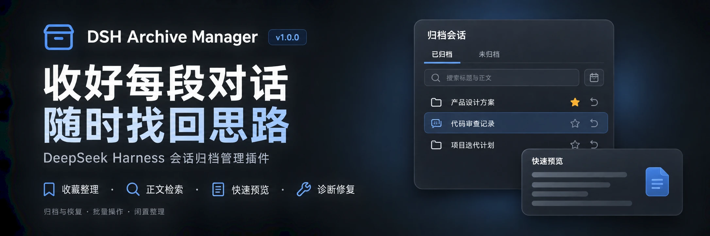
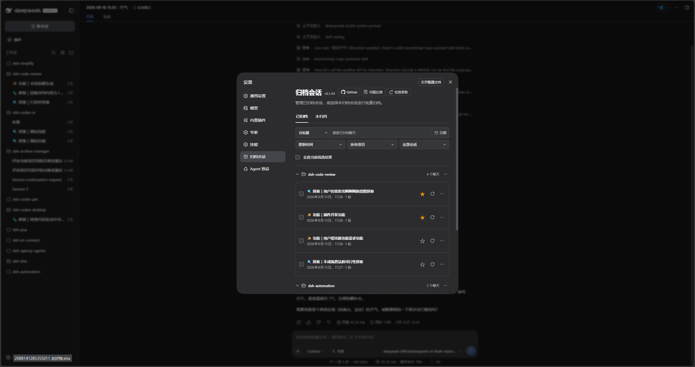
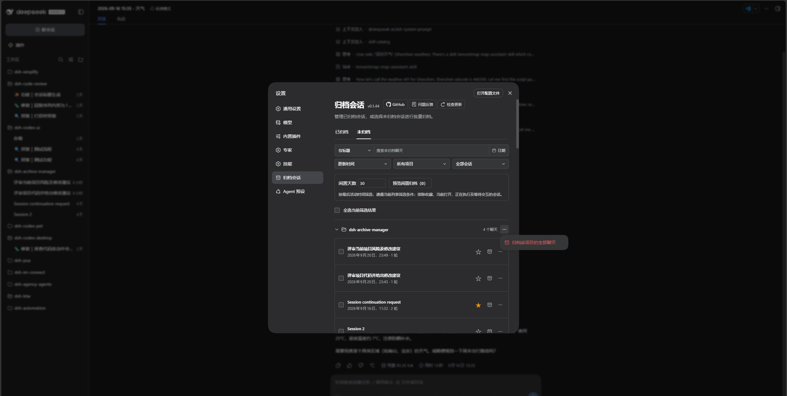

<p align="center">
  
</p>

<div align="center">

# DSH Archive Manager

  **在 DeepSeek Harness 中安全管理已归档会话**

  [English](README.md) · [更新日志](CHANGELOG.zh-CN.md) · [1.0.0 发行说明](RELEASE_NOTES.md) · [Apache-2.0](LICENSE)

  [](LICENSE)
  [](https://www.npmjs.com/package/@michengai/dsh-archive-manager)
  [](https://www.npmjs.com/package/@michengai/dsh-archive-manager)
  [](https://github.com/MichengAI/dsh-archive-manager)
</div>

> DSH Archive Manager 是社区维护的 DeepSeek Harness（DSH）插件，并非 DeepSeek AI 官方产品。

## 你可以用它做什么

把暂时不用的会话收起来，需要时再找回，让日常任务列表更清爽。

- **归档会话**：收起单条聊天，或整个工作区的未归档聊天。
- **找回历史**：搜索标题与正文，组合项目、收藏和日期筛选，按时间、标题或轮次排序。
- **恢复任务**：恢复单条、选中的会话或整个项目；可全选当前筛选结果后批量操作。
- **清理记录**：确认后永久删除不再需要的归档会话，查看批量进度并重试剩余项。
- **整理重要会话**：收藏常用聊天，预览闲置归档候选，保护收藏与活跃任务。
- **查看与排障**：不恢复即可快速预览，复制会话 ID／路径，诊断异常并定向修复支持的旧日志。

> 本文对应 1.0.0 版本，完整功能清单与升级边界见发行说明。

## 异常会话诊断与修复

归档页自动汇总读取异常，展开「诊断与修复」可查看原因和处理建议。点击「诊断会话」，符合规则时再点击「确认修复」。当前支持旧自动化消息来源的定向转换，保留原日志、正文及任务归属。修复要求会话已归档且未在任何 DSH 进程中打开；文件缺失、权限问题与未知损坏只给出处理建议，不删除或截断日志。

## 检索与预览

- 已归档与未归档统一支持标题／正文搜索、日期、项目、收藏及创建时间排序；两边均可通过星标收藏和取消收藏。未归档的正文命中点击打开完整会话。

- 快速预览默认以 Markdown 排版展示，支持表格、引用与代码块，区分用户和助手；可切换为原文与关键词高亮。

- 在搜索框左侧选择「标题与正文」，可搜索当前页签会话中的用户和助手文本；默认仍只搜索标题。
- 搜索框右侧「日期」可选择或清除更新时间范围；项目、收藏和更新时间范围可组合使用；结束日期包含本地当天。已归档和未归档页均支持正文搜索与这些筛选条件。
- 正文命中显示片段和关键词高亮；已归档页点击片段或「更多 → 快速预览」查看上下文，不恢复会话；未归档页点击片段打开完整会话。没有关键词时预览最近八条消息，有关键词时定位首个命中附近。
- 检索逐批读取，每批最多 20 条会话，批内逐条读取；关键词最多 200 字符。预览每条最多 2000 个 UTF-16 码元，截断保留完整 Unicode 字符，较长内容请打开完整会话。
- 搜索与预览不包含工具输出、附件、推理、系统或插件注入消息；读取失败会显示详情并支持重试。检索的是持久化原始文本，不等同于模型当前上下文。
- 未建立持久化全文索引，大量或超长会话可能需要较久，建议先缩小项目、日期或收藏范围；尚无可承诺的会话数量上限或响应时延；更改条件会停止后续批次，正在读取的单批仍会完成，但旧结果不会覆盖新筛选。
## 轮次与定位

- 已归档和未归档列表均在时间旁显示轮次。每条用户提交消息算一轮，包括图片消息；助手回复、工具调用和插件注入不计入。
- 排序菜单新增「轮次最多／轮次最少」，轮次相同按更新时间及标题排序。读取失败显示「轮次未知」，放在已知轮次之后，并提供失败明细和重试。
- 每行「更多」菜单提供「复制会话 ID／复制会话路径」。官方 JSONL 存储复制会话目录，其他后端复制宿主提供且存在的文件路径；路径缺失会提示，不猜测路径。
- 详情每批读取最多 20 条，不激活或恢复会话。统计来自原始日志；分支中继承的用户消息也计入。较多长日志可能需要等待，未建立持久化轮次索引。
- 剪贴板需要 HTTPS 或本机地址及浏览器权限；复制失败会明确提示，不显示成功。

## 界面预览

在「设置 → 归档会话 → 已归档」检索、收藏、预览、恢复和清理：



切换到「未归档」，使用相同筛选条件整理会话，预览闲置归档或按项目批量归档：



> 截图来自发布前开发版，界面中版本标识为 0.1.44；本次发行版本为 1.0.0。侧栏由当前安装的 UI 插件提供，不代表本插件新增的侧栏功能。

## 前置条件

- 已能正常使用 [DeepSeek Harness](https://github.com/deepseek-ai/deepseek-harness) Web，并可在终端运行 `dsh`。
- 当前支持 DSH `0.1.0-rc.8`、`0.1.1-rc.2`、`0.1.2-rc.1`、`0.1.5-rc.1`、`0.1.5-rc.2`、`0.1.6-alpha.1`、`0.1.6-alpha.2`；其他版本暂未纳入支持范围。
- Node.js 版本需满足 `^22.19.0 || >=24.0.0`；从源码安装还需要 pnpm。

## 安装

以下示例使用 `web` profile，请替换为你实际使用的 profile。

### 让 Agent 帮你安装

把下面这段话发给能执行本机终端命令的 Agent：

```text
请将 @michengai/dsh-archive-manager 最新版安装到本机 DSH 的 web profile，使用官方 npm 源。安装后检查插件配置，并告诉我如何重新加载 DSH、进入归档会话管理页。
```

### 手动安装

在 PowerShell 中执行：

```powershell
[Console]::OutputEncoding = [System.Text.Encoding]::UTF8
$OutputEncoding = [System.Text.Encoding]::UTF8

dsh plugin --profile web add @michengai/dsh-archive-manager@latest --registry=https://registry.npmjs.org/
```

安装后重启 DSH Web，并按 `Ctrl+Shift+R` 硬刷新浏览器。打开「设置 → 归档会话」即可使用。

## 使用

| 你想做什么 | 操作 |
| --- | --- |
| 归档一条会话 | 打开侧栏会话菜单，选择「归档会话」 |
| 归档整个工作区 | 打开工作区菜单，选择归档该工作区的会话 |
| 查找归档 | 打开「设置 → 归档会话」，选择标题／正文搜索，组合项目、收藏和日期筛选 |
| 调整排列顺序 | 按更新时间、创建时间、标题、轮次最多／最少排序 |
| 恢复一条会话 | 点击会话右侧的恢复图标；更多菜单可「恢复打开」 |
| 归档某个项目或未分组 | 在「未归档」页点击分组右侧“…”菜单，确认归档该组全部聊天；不受搜索筛选影响 |
| 收藏会话 | 点击行右侧星标，使用收藏下拉菜单筛选 |
| 快速查看归档内容 | 点击命中片段或「更多 → 快速预览」 |
| 整理闲置会话 | 在未归档页设置天数，预览、检查候选后确认归档 |
| 定位会话文件 | 在更多菜单复制会话 ID 或路径 |
| 处理读取异常 | 展开诊断与修复，先诊断，再按资格确认修复 |
| 跨项目批量归档 | 切换到「未归档」，跨项目勾选会话后点击「归档」并确认 |
| 批量恢复或删除 | 勾选会话后使用批量操作；也可使用项目菜单；页面不再提供独立的全部恢复／全部删除按钮 |

页面默认打开「已归档」，右侧「未归档」用于批量归档。切换 TAB 会清空选择；切换搜索或项目筛选会保留已选会话。批量操作前留意隐藏的已选数量，或先清空选择。

### 收藏与闲置整理

会话使用紧凑分组列表，点击项目标题可以折叠；右侧提供星标和恢复／归档图标，已归档会话的「更多」菜单提供恢复打开和删除。折叠只影响展示，「全选当前筛选结果」仍包含折叠组内符合筛选的会话。

- 在已归档或未归档会话行右侧点击星标，通过收藏下拉菜单中的「只看收藏」找回重要会话。收藏保存在宿主数据中，归档、恢复或更换浏览器不会清除；其他页面修改的收藏可在重新打开管理页后读取。
- 在「未归档」设置 1～36500 的整数闲置天数，结合当前项目、搜索、日期和收藏筛选，点击「预览闲置归档」。确认清单允许逐条取消，默认排除收藏、当前打开、正在执行（含子代理）以及等待交互的会话；缺少有效最后活动时间的会话不参与。
- 归档前再次检查收藏和活动状态。批量归档、恢复、删除显示进度与成功／跳过／失败／未处理数量；首个失败后停止，支持只重试剩余项。删除重试仍需确认。
- 「撤回本次归档」只恢复最近一批实际归档成功的会话，包括该批重试成功的部分。仅在本次打开管理页期间有效，关闭页面或刷新会清除记录；不会撤回原有归档，也不能恢复永久删除的会话。
- 收藏会话仍可手动归档；收藏保护只针对闲置整理。没有定时自动归档，不会在后台自行整理。

「全选当前筛选结果」只选择符合当前条件的会话。项目菜单的整体操作仍作用于该项目全部会话，不受搜索筛选影响。未归档页排除子代理和空白占位会话。

设置页与侧栏的批量归档、批量恢复均串行调用单条接口：归档在所有支持的宿主走官方 `ctx.workspaces.archiveSession`；恢复在 DSH 0.1.6+ 走官方 `ctx.workspaces.unarchiveSession`，更早宿主回退到本插件的 `workspaceRegistry.unarchiveSession`。

### 查看并继续归档对话

原生会话导航自 `0.1.40` 起提供，1.0.0 的操作入口如下：

- **点击会话标题**：打开 DSH 原生会话页，查看消息、附件和工具详情；可直接继续聊天，保持归档状态。
- **更多菜单 → 恢复打开**：取消归档后进入原会话，继续工作。

## 检索接口兼容约定（集成开发者）

正式入口为 `workspaceRegistry.searchSessionContent({ sessionIds, query })`，支持已归档与未归档会话。输入为 1～20 个会话 ID 和 1～200 字符非空关键词，ID 去重后处理。成功返回 `{ items: [{ sessionId, seq, snippet }], failures: [{ sessionId, message }] }`；单条读取失败进入 `failures`，参数不合法则拒绝整个调用。

`searchArchivedContent` 是旧客户端兼容入口，仅接受归档范围，保持原有语义。两者通过宿主 Typert 的既有连接与权限边界调用，无新增 HTTP 端点或鉴权配置。当前受支持版本范围内保留旧描述符，不在补丁版本移除；只有未来明确收窄兼容范围、完成客户端迁移并发布弃用说明后才删除。新客户端优先使用正式入口，旧入口仅用于旧版本回退；不应向两个入口重复发送同一检索。

## 更新

在归档管理页标题处点击「检查更新」。支持自动更新的 DSH CLI 或 Desktop 环境可直接更新；其他环境会提供适用于当前 profile 的手动命令。也可重新执行上面的安装命令。

## 常见问题

### 安装后找不到入口？

先重启 DSH Web 并硬刷新浏览器，确认安装到了当前使用的 profile。仍未显示时，执行：

```powershell
[Console]::OutputEncoding = [System.Text.Encoding]::UTF8
$OutputEncoding = [System.Text.Encoding]::UTF8

dsh --profile web --dump-config
```

配置中应包含 `workspace-archive-manager` 和 `ui-workspace-archive-manager`。DSH 0.1.6+ 上官方 `ui-settings-unarchive-sessions` 应为 `disabled: true`，设置里只保留本插件的「归档会话」。若曾在 profile 的 `cordis.patch.yml` 中手动将官方 `ui-workspace` 设为 `disabled: true`，请移除该禁用覆盖，再重启。

### 归档和删除有什么区别？

归档只是收起会话，可以恢复。**永久删除无法撤销**，并可能一并清理该会话的附件；不会删除你的项目工作目录。删除前会要求确认。

### 可以和 Codex UI 一起使用吗？

可以。保留 [Codex UI](https://github.com/MichengAI/dsh-codex-ui) 的侧栏样式和交互，归档管理仍在「设置 → 归档会话」中。

遇到其他问题，请提交 [Issue](https://github.com/MichengAI/dsh-archive-manager/issues)，附上 DSH 与插件版本、复现步骤和错误信息。

## 从源码安装

<details>
<summary>开发或测试未发布改动时展开</summary>

在你选择的源码目录中执行以下命令。未推送的本地改动需使用已有工作副本。

```powershell
[Console]::OutputEncoding = [System.Text.Encoding]::UTF8
$OutputEncoding = [System.Text.Encoding]::UTF8

git clone https://github.com/MichengAI/dsh-archive-manager.git
Set-Location .\dsh-archive-manager
pnpm install --frozen-lockfile
pnpm build
dsh plugin --profile web add .
```

完成后重启 DSH Web 并硬刷新浏览器。修改 [src](src) 中的源码，不直接编辑生成目录 `lib`；使用 `pnpm test` 验证修改，使用 `pnpm verify` 执行完整检查。

</details>

## DSH 产品生态

想使用桌面工作台，可下载 [DSH Codex Desktop](https://github.com/MichengAI/dsh-codex-desktop/releases)；已有 [DeepSeek Harness](https://github.com/deepseek-ai/deepseek-harness) 环境，可按各项目 README 按需安装。以下列出 11 个自研插件；桌面端实际随附范围以对应版本的发行说明和内置清单为准。

| 插件 | 你可以用它做什么 |
| --- | --- |
| [Codex UI](https://github.com/MichengAI/dsh-codex-ui) | 整理项目与会话、搜索任务、跳转对话轮次 |
| [Agency Agents](https://github.com/MichengAI/dsh-agency-agents) | 按任务选择并召唤专业角色 |
| [Skills Manager](https://github.com/MichengAI/dsh-skills-manager) | 统一查找、启停、创建和导入本机技能 |
| [Archive Manager](https://github.com/MichengAI/dsh-archive-manager) | 搜索、恢复或清理已归档会话 |
| [IM Connect](https://github.com/MichengAI/dsh-im-connect) | 从消息平台下任务、收回复 |
| [Automation](https://github.com/MichengAI/dsh-automation) | 按计划执行任务，查看每次运行的结果 |
| [BTW](https://github.com/MichengAI/dsh-btw) | 在当前上下文中临时旁问，不打断主任务 |
| [Simplify](https://github.com/MichengAI/dsh-simplify) | 用 `/simplify` 整理 Git 改动范围内的代码 |
| [PUA](https://github.com/MichengAI/dsh-pua) | 引导 Agent 在失败时换方法、查原因，并在完成前验证结果 |
| [Code Review](https://github.com/MichengAI/dsh-code-review) | 用 `/review` 发起独立 Agent 代码审查，在当前会话接收报告 |
| [Codex Pet](https://github.com/MichengAI/dsh-codex-pet) | 通过桌面宠物查看会话提醒、处理工具审批和问题回答 |


## 许可证

本项目采用 [Apache License 2.0](LICENSE)。
